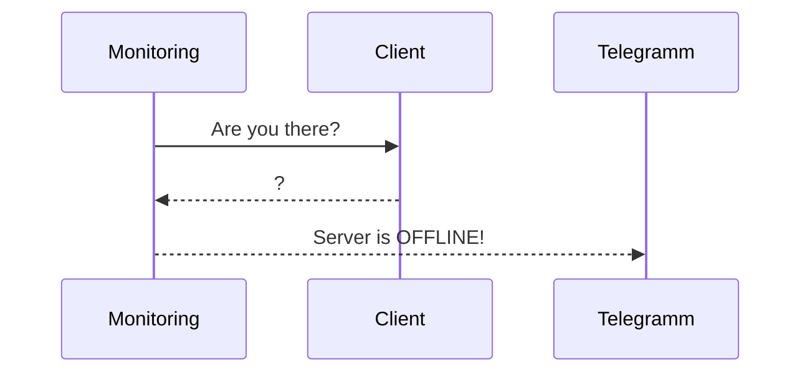
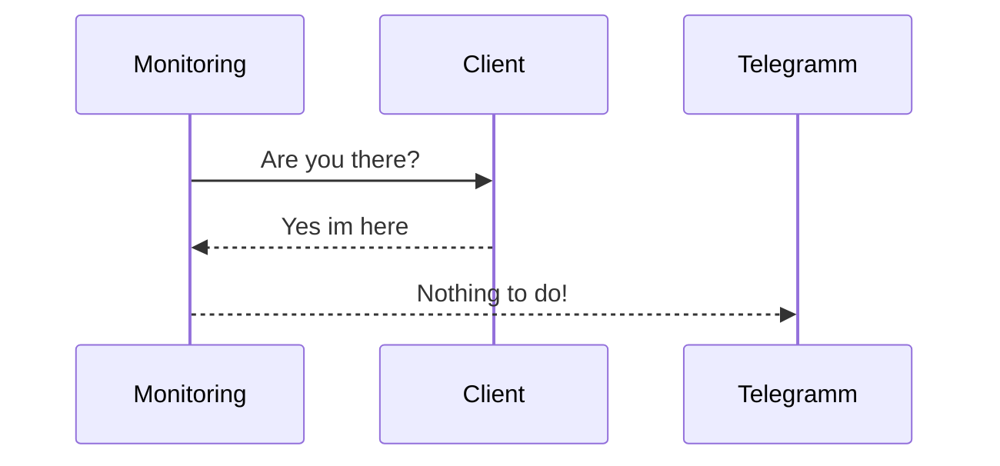

# Telegramm-ICMP-Ping
This Script ping's Hosts and if they not reachable it will create an notification to a Telegramm Chat

If the Server is not Online or responding

If the Server is Online and responding

